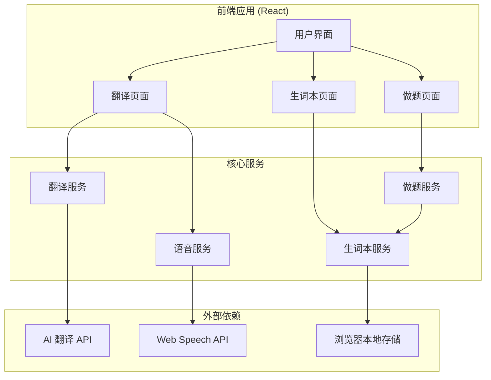

# Design Document: 大白话翻译网站

## Overview

本设计文档描述大白话翻译网站的技术架构和实现方案。该网站是一个前端单页应用（SPA），使用 AI API 进行智能翻译，浏览器本地存储管理生词本，Web Speech API 实现语音播放。

## Architecture



## Components and Interfaces

### 1. 翻译服务 (TranslateService)

负责调用 AI API 获取大白话翻译结果。

```typescript
interface TranslationResult {
  originalWord: string;        // 原词
  plainExplanation: string;    // 大白话解释
  lifeAnalogy: string;         // 生活比喻
  essenceExplanation: string;  // 本质说明
  usageScenarios: string[];    // 应用场景
  englishWord: string;         // 英文表达
  phonetic: string;            // 音标
  timestamp: number;           // 查询时间
}

interface TranslateService {
  translate(word: string): Promise<TranslationResult>;
}
```

### 2. 生词本服务 (VocabService)

管理用户收藏的词汇，使用 localStorage 持久化。

```typescript
interface VocabService {
  addWord(result: TranslationResult): void;
  removeWord(word: string): void;
  getAllWords(): TranslationResult[];
  getWordCount(): number;
  hasWord(word: string): boolean;
}
```

### 3. 做题服务 (QuizService)

从生词本生成练习题目。

```typescript
interface QuizQuestion {
  id: string;
  scenario: string;           // 场景描述或比喻
  correctAnswer: string;      // 正确答案
  fullResult: TranslationResult; // 完整翻译结果
}

interface QuizService {
  generateQuestion(): QuizQuestion | null;
  checkAnswer(questionId: string, userAnswer: string): boolean;
}
```

### 4. 语音服务 (TTSService)

使用 Web Speech API 播放英文发音。

```typescript
interface TTSService {
  speak(text: string): void;
  stop(): void;
  isSupported(): boolean;
}
```

### 5. 页面组件

```typescript
// 翻译页面
interface TranslatePageProps {}

// 生词本页面
interface VocabPageProps {}

// 做题页面
interface QuizPageProps {}

// 翻译结果卡片
interface TranslationCardProps {
  result: TranslationResult;
  onAddToVocab: () => void;
  onPlayAudio: () => void;
  isInVocab: boolean;
}

// 做题卡片
interface QuizCardProps {
  question: QuizQuestion;
  onSubmit: (answer: string) => void;
  onNext: () => void;
}
```

## Data Models

### TranslationResult

存储在 localStorage 中的词汇数据结构：

```typescript
interface TranslationResult {
  originalWord: string;        // 用户输入的原词
  plainExplanation: string;    // 通俗易懂的解释
  lifeAnalogy: string;         // 生活中的比喻
  essenceExplanation: string;  // 本质是什么
  usageScenarios: string[];    // 出现场景列表
  englishWord: string;         // 英文单词/短语
  phonetic: string;            // 音标
  timestamp: number;           // 添加时间戳
}
```

### LocalStorage Schema

```typescript
// 键名: "vocab_book"
// 值: TranslationResult[] 的 JSON 字符串
```

## Correctness Properties

*A property is a characteristic or behavior that should hold true across all valid executions of a system—essentially, a formal statement about what the system should do. Properties serve as the bridge between human-readable specifications and machine-verifiable correctness guarantees.*

### Property 1: 生词本添加后可检索

*For any* 翻译结果，如果将其添加到生词本，则通过 `getAllWords()` 应能检索到该词汇，且 `hasWord()` 返回 true。

**Validates: Requirements 3.2, 3.5**

### Property 2: 生词本数量一致性

*For any* 生词本操作序列，`getWordCount()` 的返回值应始终等于 `getAllWords().length`。

**Validates: Requirements 3.3**

### Property 3: 生词本持久化往返

*For any* 添加到生词本的词汇，刷新页面后重新加载，应能获取到相同的词汇数据。

**Validates: Requirements 3.4**

### Property 4: 做题从生词本抽取

*For any* 生成的题目，其对应的词汇必须存在于当前生词本中。

**Validates: Requirements 4.1**

### Property 5: 答案判断一致性

*For any* 题目和用户答案，如果用户答案与正确答案匹配（忽略大小写和首尾空格），则判断为正确。

**Validates: Requirements 4.4**

### Property 6: 重复添加幂等性

*For any* 已存在于生词本的词汇，再次添加不应增加生词本数量，且应提示已存在。

**Validates: Requirements 3.7**

### Property 7: 翻译结果完整性

*For any* 成功的翻译请求，返回的 TranslationResult 必须包含所有必需字段且非空。

**Validates: Requirements 1.2**

## Error Handling

| 场景 | 处理方式 |
|------|----------|
| AI API 调用失败 | 显示友好错误提示，建议用户重试 |
| 网络连接中断 | 显示离线提示，生词本功能仍可用 |
| localStorage 已满 | 提示用户清理旧数据或导出备份 |
| 语音合成不支持 | 隐藏播放按钮，显示音标供用户参考 |
| 生词本为空时做题 | 显示提示引导用户先添加词汇 |
| 输入为空 | 禁用提交按钮，显示输入提示 |

## Testing Strategy

### 单元测试

- VocabService: 测试添加、删除、查询、持久化功能
- QuizService: 测试题目生成、答案判断逻辑
- TTSService: 测试浏览器兼容性检测

### 属性测试

使用 fast-check 进行属性测试：

- 生词本操作的数据一致性
- 答案判断的边界情况
- 持久化的往返正确性

### 集成测试

- 翻译流程：输入 → API 调用 → 结果展示
- 生词本流程：添加 → 存储 → 刷新 → 恢复
- 做题流程：生成题目 → 输入答案 → 判断 → 反馈
