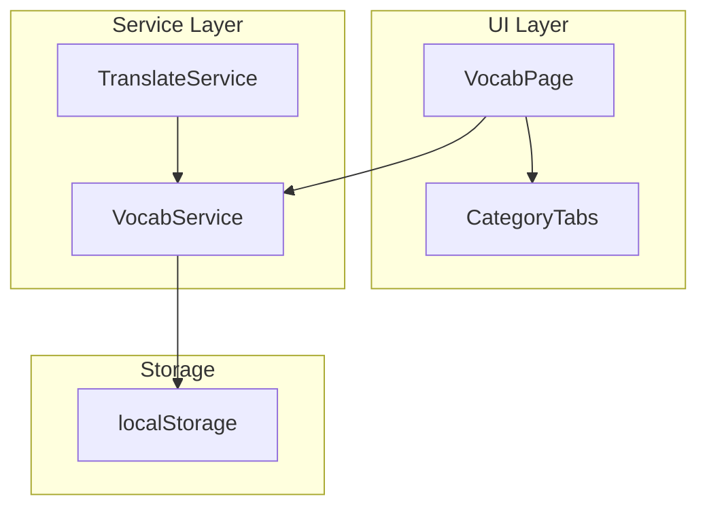

# Design Document

## Overview

生词本自动分类功能通过在翻译时让 AI 返回词汇分类，实现词汇的自动归类。用户可以在生词本页面通过分类标签筛选词汇，提升学习效率。

## Architecture



## Components and Interfaces

### 1. 数据类型扩展

在 `TranslationResult` 中添加分类字段：

```typescript
export interface TranslationResult {
  // ... 现有字段
  /** 词汇分类 */
  category: VocabCategory;
}

/** 词汇分类枚举 */
export type VocabCategory = 
  | '日常生活'
  | '工作职场'
  | '科技数码'
  | '情感表达'
  | '学术教育'
  | '其他';

/** 所有分类列表 */
export const VOCAB_CATEGORIES: VocabCategory[] = [
  '日常生活',
  '工作职场',
  '科技数码',
  '情感表达',
  '学术教育',
  '其他'
];
```

### 2. TranslateService 修改

修改 AI prompt，让其返回分类信息：

```typescript
// 在 prompt 中添加分类要求
{
  // ... 现有字段
  "category": "从以下分类中选择一个：日常生活、工作职场、科技数码、情感表达、学术教育、其他"
}
```

### 3. VocabService 扩展

添加按分类获取词汇的方法：

```typescript
interface VocabService {
  // ... 现有方法
  
  /** 按分类获取词汇 */
  getWordsByCategory(category: VocabCategory): TranslationResult[];
  
  /** 获取各分类的词汇数量 */
  getCategoryStats(): Record<VocabCategory, number>;
}
```

### 4. VocabPage 组件更新

添加分类标签栏和筛选逻辑：

```typescript
interface CategoryTabsProps {
  categories: VocabCategory[];
  selectedCategory: VocabCategory | 'all';
  onSelect: (category: VocabCategory | 'all') => void;
  stats: Record<VocabCategory, number>;
}
```

## Data Models

### 存储结构

词汇数据存储在 localStorage 中，结构不变，只是每个词汇对象增加 `category` 字段：

```json
{
  "vocab_book": [
    {
      "originalWord": "算法",
      "category": "科技数码",
      // ... 其他字段
    }
  ]
}
```

### 向后兼容

对于已存在的没有 `category` 字段的词汇，默认归类为"其他"。


## Correctness Properties

*A property is a characteristic or behavior that should hold true across all valid executions of a system—essentially, a formal statement about what the system should do. Properties serve as the bridge between human-readable specifications and machine-verifiable correctness guarantees.*

### Property 1: 分类信息持久化 (Round-trip)

*For any* 带有有效分类的词汇，添加到生词本后再获取，其分类信息应该与原始分类完全一致。

**Validates: Requirements 1.2**

### Property 2: 分类筛选正确性

*For any* 词汇列表和任意分类，使用该分类筛选后的结果中，每个词汇的分类都应该等于筛选条件。

**Validates: Requirements 2.2**

### Property 3: 分类统计一致性

*For any* 词汇列表，所有分类的词汇数量之和应该等于词汇总数。

**Validates: Requirements 2.4**

## Error Handling

1. **分类缺失处理**: 如果 AI 返回的分类不在预设列表中，或者旧数据没有分类字段，默认归类为"其他"
2. **空列表处理**: 当某分类没有词汇时，显示数量为 0，不隐藏该分类标签

## Testing Strategy

### 单元测试
- 测试 `getWordsByCategory` 方法的筛选逻辑
- 测试 `getCategoryStats` 方法的统计逻辑
- 测试向后兼容：旧数据自动归类为"其他"

### 属性测试 (使用 fast-check)
- Property 1: 分类信息 round-trip 测试
- Property 2: 筛选结果验证
- Property 3: 统计数量一致性

每个属性测试运行 100 次迭代。
